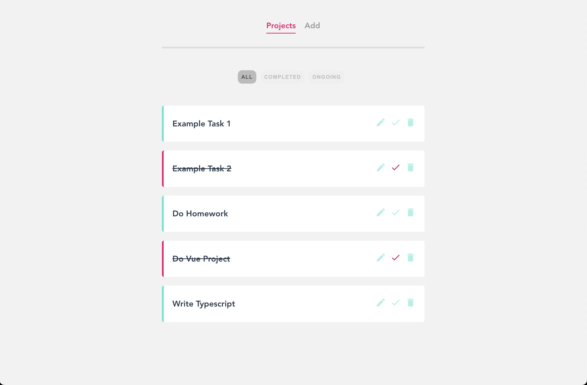
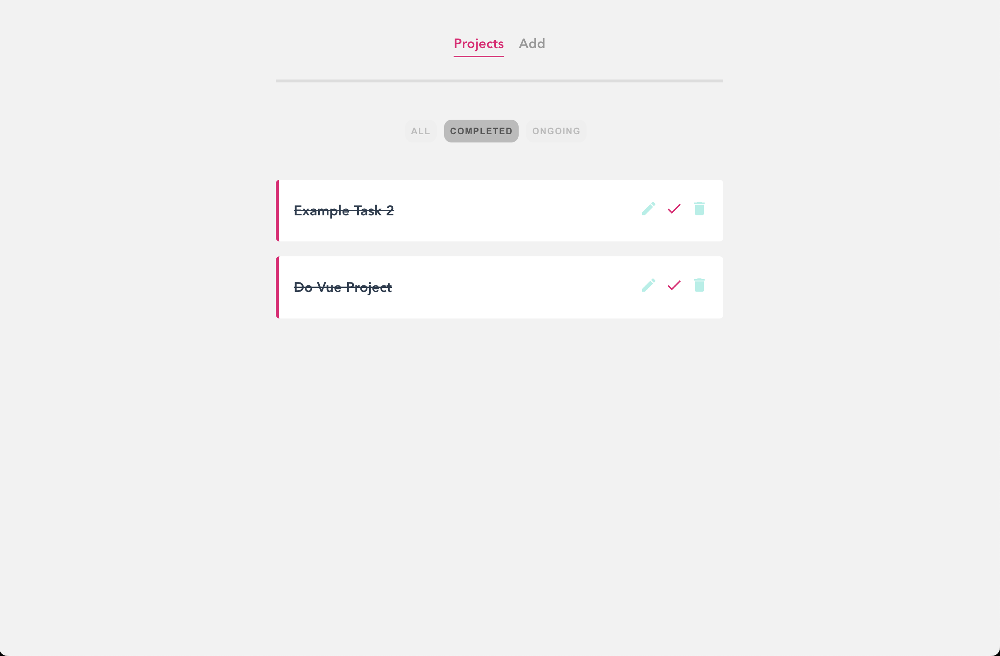

# Vue Journey 🚀

Vue.js öğrenme yolculuğumun adım adım ilerleyişini ve mini projelerle pekiştirdiğim örnekleri içeren bir repo. React tecrübem var, ancak kariyerim için Vue.js'e geçiş yapmam gerekti. Bu repo, Vue.js'in temelinden ileri düzeye kadar olan konuları, her biri ayrı klasörde olacak şekilde örneklerle anlatıyor.

## Proje Hakkında

Bu repoda, Vue.js'in temel kavramlarından başlayıp, gerçek dünya uygulamalarına kadar uzanan bir öğrenme yolculuğu bulacaksınız. Her klasör, belirli bir konsepti veya mini projeyi temsil eder. Kodlar sade, anlaşılır ve öğretici olacak şekilde yazılmıştır.

## İçindekiler ve Açıklamalar

| Klasör                                   | Açıklama                                                              | Öne Çıkanlar                                      |
| ---------------------------------------- | --------------------------------------------------------------------- | ------------------------------------------------- |
| **01-Vue-Giris**                         | Vue.js'e ilk adım, CDN ile temel kurulum ve basit veri gösterimi.     | Temel Vue instance, data binding                  |
| **02-Vue-Temel-Uygulama**                | Basit bir Vue uygulaması ile temel yapı taşları.                      | v-model, event handling                           |
| **03-V-IF-ve-V-SHOW**                    | Koşullu render işlemleri, görünürlük kontrolü.                        | v-if, v-else, v-show                              |
| **04-For-Loop**                          | Listeler üzerinde döngü ile veri gösterimi.                           | v-for, key kullanımı                              |
| **05-V-Bind**                            | HTML attribute'larını dinamik olarak bağlama.                         | v-bind, class ve style binding                    |
| **06-Uygulama-1**                        | Önceki konuların birleşimiyle mini uygulama.                          | Bileşen birleştirme                               |
| **07-CLI/vue-cli**                       | Vue CLI ile modern proje başlatma, dosya yapısı.                      | Vue CLI, single file component (SFC)              |
| **08-Vue-Router/router-app**             | Çok sayfalı uygulama, sayfa yönlendirme.                              | Vue Router, dinamik route, 404 sayfası            |
| **09-Project-1-Planner/project-planner** | Proje planlayıcı: CRUD işlemleri, filtreleme, router.                 | Vue Router, component iletişimi, local storage    |
| **10-Firebase-app/firebase-app**         | Vue ile Firebase kullanımı, gerçek zamanlı veri.                      | Firebase Realtime Database, veri çekme/gönderme   |
| **11-Blog/blog-project**                 | Blog uygulaması: yazı ekleme, listeleme, detay sayfası.               | Firebase, Vue Router, dinamik route parametreleri |
| **12-Chat-app/chat-app**                 | Gerçek zamanlı chat uygulaması, kullanıcı yönetimi.                   | Firebase Auth, Firestore, custom composables      |
| **13-ticktacktoe-app**                   | XOX oyunu, oyun mantığı ve state yönetimi.                            | State yönetimi, component iletişimi               |
| **14-Playlist-app/playlist**             | Playlist uygulaması: şarkı ekleme, kullanıcı yönetimi, dosya yükleme. | Firebase Storage, Auth, Firestore, Vuex           |

## Kurulum

Her klasör kendi bağımsız projesidir. İlgili klasöre girip aşağıdaki adımları izleyebilirsin:

```bash
cd <proje-klasörü>
npm install
npm run serve
```

## Canlı Demo

- [Todo App Demo](https://vue-complete-todo-list.netlify.app)

## Ekran Görüntüleri

### Project Planner

Ana Sayfa  


Filtrelenmiş Ana Sayfa  


## Kullanılan Teknolojiler

- Vue.js 2/3 (proje bazında değişiyor)
- Vue CLI
- Vue Router
- Vuex (Playlist projesinde)
- Firebase (Realtime Database, Firestore, Auth, Storage)
- HTML, CSS, JavaScript

## Katkı

Bu repo kişisel öğrenme amaçlıdır. Ancak öneri ve katkılara açığım. PR gönderebilirsiniz.

## Lisans

MIT
